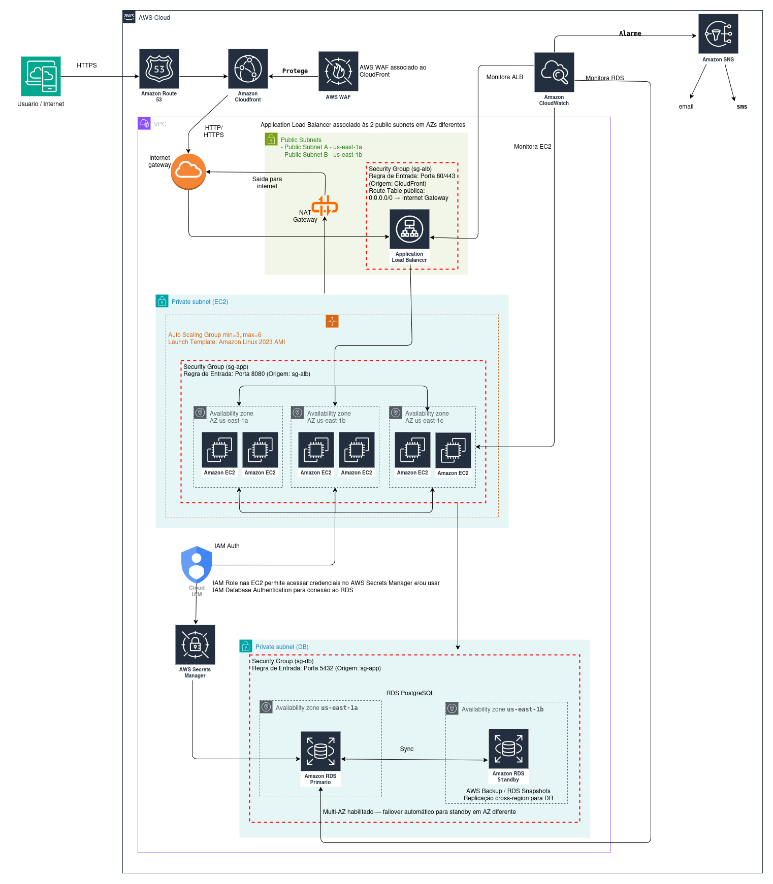

# Arquitetura Escalável na AWS

## Descrição do Projeto

Este diagrama representa a arquitetura de uma aplicação web escalável, altamente disponível e segura na AWS, seguindo as melhores práticas de design em nuvem.

## Diagrama da Arquitetura

## Visão Geral da Arquitetura

A arquitetura implementa um padrão multi-camada distribuído em múltiplas zonas de disponibilidade, garantindo escalabilidade, resiliência e segurança:

- **Camada de Entrega**: Route 53 (DNS) + CloudFront (CDN)
- **Camada de Segurança**: AWS WAF (Firewall de aplicação web)
- **Camada de Distribuição de Carga**: Application Load Balancer
- **Camada de Aplicação**: Auto Scaling Group com instâncias EC2
- **Camada de Dados**: Amazon RDS PostgreSQL com Multi-AZ

---

## Componentes da Arquitetura

### 1. Camada de Internet e DNS

#### **AWS Route 53**

- Serviço de DNS totalmente gerenciado
- Roteia o tráfego do usuário para o CloudFront
- Responsável pela resolução de nomes de domínio

#### **Amazon CloudFront**

- Rede de distribuição de conteúdo (CDN) global
- Armazena em cache conteúdo estático para menor latência
- Distribui requisições para a origem (Application Load Balancer) através do AWS WAF

### 2. Camada de Segurança

#### **AWS WAF (Web Application Firewall)**

- Associado ao CloudFront para proteção contra ataques web comuns:
  - SQL Injection (SQLi)
  - Cross-Site Scripting (XSS)
  - Bot control
  - Rate limiting
- Filtra requisições maliciosas antes de chegar ao load balancer
- Protege toda a aplicação com regras customizáveis
- Reduz latência ao bloquear ataques na origem (edge locations do CloudFront)

### 3. Infraestrutura VPC

#### **VPC (Virtual Private Cloud)**

- Ambiente isolado e seguro para os recursos AWS
- Contém subnets públicas e privadas distribuídas em múltiplas AZs

#### **Internet Gateway**

- Permite comunicação entre a VPC e a internet
- Vinculado às subnets públicas
- Ponto de entrada do tráfego CloudFront → ALB
- Ponto de saída do tráfego NAT Gateway → internet

#### **Subnets Públicas**

- **Public Subnet A** (us-east-1a)
- **Public Subnet B** (us-east-1b)
- Hospedam o Application Load Balancer distribuído entre as 2 AZs
- Hospedam o NAT Gateway para permitir saída de tráfego das instâncias EC2 privadas
- Conectadas ao Internet Gateway via route table pública (0.0.0.0/0 → Internet Gateway)

#### **Private Subnet (EC2)**

- Engloba instâncias EC2 distribuídas em 3 AZs:
  - us-east-1a — 2 instâncias EC2
  - us-east-1b — 2 instâncias EC2
  - us-east-1c — 2 instâncias EC2
- Isoladas da internet direta; acessam a internet somente via NAT Gateway (saída)
- Sem exposição direta a partir da internet

#### **Private Subnet (DB)**

- Hospeda as instâncias RDS (primário em us-east-1a, standby em us-east-1b)
- Completamente isolada da internet
- Acesso permitido somente pelas instâncias EC2 via Security Group

### 4. Camada de Distribuição de Carga

#### **Application Load Balancer (ALB)**

- Opera na Camada 7 (Aplicação) do modelo OSI
- Distribui requisições HTTP/HTTPS entre instâncias EC2 do Auto Scaling Group
- Configurado nas duas subnets públicas (us-east-1a e us-east-1b) para alta disponibilidade
- Recebe tráfego nas portas 80 e 443 e roteia para as instâncias EC2 na porta 8080
- **Security Group (sg-alb)**:
  - Entrada: Portas 80/443 (HTTP/HTTPS) com origem restrita ao CloudFront
  - Route Table pública: 0.0.0.0/0 → Internet Gateway

### 5. Camada de Aplicação

#### **Amazon EC2 Auto Scaling Group**

- **Configuração**:
  - Mínimo: 3 instâncias
  - Máximo: 6 instâncias
  - AMI: Amazon Linux 2023

- **Distribuição na Private Subnet (EC2)**:
  - **AZ us-east-1a**: 2 instâncias EC2
  - **AZ us-east-1b**: 2 instâncias EC2
  - **AZ us-east-1c**: 2 instâncias EC2
  - Distribuição equilibrada garante alta disponibilidade mesmo com falha de uma AZ inteira

- **Security Group (sg-app)**:
  - Entrada: Porta 8080 originada apenas do ALB (sg-alb)
  - Isolamento de rede com princípio de menor privilégio

#### **NAT Gateway**

- Localizado na subnet pública
- Permite que as instâncias EC2 (em subnets privadas) realizem tráfego de saída para a internet
- Fluxo: EC2 → NAT Gateway → Internet Gateway → Internet
- Não permite conexões de entrada iniciadas pela internet

#### **IAM Roles**

- Anexadas às instâncias EC2 para acesso controlado
- Permitem autenticação IAM com RDS (IAM Database Authentication)
- Acesso seguro ao AWS Secrets Manager para recuperação de credenciais do banco de dados

#### **AWS Secrets Manager**

- Armazena credenciais do banco de dados com segurança
- Acesso controlado via IAM Roles anexadas às EC2
- Elimina credenciais hardcoded no código ou em variáveis de ambiente

### 6. Camada de Dados

#### **Amazon RDS PostgreSQL**

- **Configuração de Alta Disponibilidade**:
  - Instância Primária em **us-east-1a** (leitura e escrita)
  - Instância Standby em **us-east-1b** (Multi-AZ habilitado)
  - Sincronização síncrona automática entre primária e standby
  - Failover automático para standby em AZ diferente em caso de falha

- **Backup e Disaster Recovery**:
  - AWS Backup com snapshots automáticos (RDS Snapshots)
  - Replicação cross-region configurada para DR
  - RPO: Minutos | RTO: Menos de 2 minutos (failover Multi-AZ automático)

- **Security Group (sg-db)**:
  - Entrada: Porta 5432 (PostgreSQL) originada apenas das instâncias EC2 (sg-app)
  - Nenhum acesso direto da internet
  - Nenhuma entrada de subnets públicas
  - Isolamento completo na Private Subnet (DB)

### 7. Monitoramento e Alarmes

#### **Amazon CloudWatch**

- Monitora métricas em tempo real de:
  - **EC2 (Auto Scaling)**: CPU, memória, tráfego de rede, status das instâncias
  - **Application Load Balancer**: Requisições/s, latência, erros 4xx/5xx, conexões ativas
  - **Amazon RDS**: CPU, conexões ativas, IOPS, espaço em disco, lag de replicação
- Alarmes configurados para disparar notificações via SNS

#### **Amazon SNS (Simple Notification Service)**

- Envia alertas via:
  - **Email**: Notificações de problemas e eventos importantes
  - **SMS**: Alertas críticos de falhas ou limites ultrapassados
- Integrado com CloudWatch para acionamento automático de alarmes

---

## Fluxo de Requisições

1. **Usuário** faz requisição HTTPS da internet
2. **Route 53** resolve o nome de domínio e direciona para o CloudFront
3. **CloudFront** recebe a requisição no edge location mais próximo:
   - Serve conteúdo cacheado se disponível
   - Roteia para a origem (ALB) se necessário
4. **AWS WAF** inspeciona a requisição e bloqueia tráfego malicioso
5. **Internet Gateway** roteia tráfego válido para as subnets públicas da VPC
6. **Application Load Balancer** distribui carga entre as instâncias EC2 saudáveis (porta 8080)
7. **Instâncias EC2** processam a lógica da aplicação:
   - Autenticam-se no RDS via IAM Database Authentication ou credenciais do Secrets Manager
   - Executam queries no banco de dados via porta 5432
8. **Amazon RDS** processa as requisições:
   - Instância primária (us-east-1a) processa leituras e escritas
   - Standby (us-east-1b) sincroniza em tempo real
9. **NAT Gateway** permite saída à internet para as EC2 (atualizações, dependências, etc.)
10. **CloudWatch** monitora todo o pipeline e aciona alarmes conforme limiares
11. **SNS** envia notificações de alerta para email e SMS

---

## Características de Segurança

### Security Groups em Camadas (Defesa em Profundidade)

| Security Group | Porta | Origem Permitida | Componente Protegido |
| --- | --- | --- | --- |
| sg-alb | 80, 443 | CloudFront | Application Load Balancer |
| sg-app | 8080 | sg-alb (somente ALB) | Instâncias EC2 |
| sg-db | 5432 | sg-app (somente EC2) | Amazon RDS |

### Isolamento de Rede

- Subnets públicas: apenas ALB e NAT Gateway
- Private Subnet (EC2): instâncias isoladas, sem acesso direto da internet
- Private Subnet (DB): RDS sem qualquer exposição externa

### Controle de Acesso

- IAM Roles nas EC2 com princípio de menor privilégio
- Credenciais do banco gerenciadas pelo AWS Secrets Manager
- Autenticação RDS via IAM Database Authentication

---

## Características de Alta Disponibilidade

### Multi-AZ

| Componente | AZs Utilizadas | Estratégia |
| --- | --- | --- |
| ALB | us-east-1a, us-east-1b | Distribuído entre 2 AZs |
| EC2 / Auto Scaling | us-east-1a, us-east-1b, us-east-1c | Instâncias em 3 AZs |
| RDS | us-east-1a (primário), us-east-1b (standby) | Failover automático |

### Auto Scaling

- Escalabilidade automática de 3 a 6 instâncias EC2
- Responde automaticamente a variações de demanda
- Auto Scaling Group substitui instâncias com falha automaticamente

### Failover

- RDS Standby assume automaticamente se a primária falhar
- ALB remove instâncias EC2 não saudáveis via health checks
- CloudFront mantém disponibilidade global via 200+ edge locations

---

## Disaster Recovery

### Backup Automático

- AWS Backup executa snapshots do RDS automaticamente
- RDS Snapshots com retenção configurável
- Replicação cross-region para recuperação em outra região AWS
- RPO (Recovery Point Objective): Minutos
- RTO (Recovery Time Objective): Menos de 2 minutos (failover Multi-AZ automático)

---

## Arquivos Incluídos

- **`diagrama.drawio`**: Arquivo fonte do diagrama (editável no Draw.io)
- **`diagrama.png`**: Versão exportada do diagrama em formato de imagem

---
